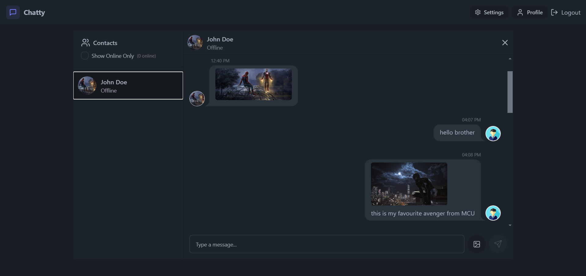

# Chatty - Frontend

Chatty is a real-time chat application built with React.js that allows users to send and receive messages in real time. The frontend is integrated with MongoDB for storing user data and messages. It uses Socket.IO to establish a real-time connection for seamless messaging. Additionally, Chatty provides theme-changing options and skeleton loading animations for a smooth user experience.



---

## Features

- 🗣 **Real-time Messaging**: Thanks to Socket.IO, users can send and receive messages instantly.
- 🎨 **Customizable Themes**: Users can change the chat application theme to personalize their experience.
- ⏳ **Skeleton Loading Animations**: Displays smooth skeleton animations while waiting for content to load, enhancing user experience.
- 📱 **Responsive Design**: The frontend is fully responsive, ensuring a seamless experience across devices.

---

## Tech Stack

- ⚛️ **React.js** - Frontend framework
- 🔌 **Socket.IO** - Real-time bidirectional event-based communication
- 🗄 **MongoDB** - Database for storing user and message data
- 🎨 **Tailwind CSS** - For styling, including theme management
- 💀 **React Skeleton** - For loading skeletons during content fetch
- 🌼 **Daisy UI** - For styling, including theme management

---

## Getting Started

To get started with the project locally, follow the steps below:

### Prerequisites

Make sure you have the following installed on your system:

- **Node.js** (v14 or higher)
- **npm** (v6 or higher)
- **MongoDB** (for local development, or you can use MongoDB Atlas)

### Installation

1. Clone the repository:

   ```bash
   git clone https://github.com/rahull0328/chatty-frontend.git
   cd chatty-frontend

2. Install the required dependencies

    ```bash
    npm install

3. Start the development server

    ```bash
    npm run dev

4. Visit http://localhost:5173/ in your browser.

---

### Contributing
We welcome contributions to the Chatty project! To contribute:

- 🍴 Fork the repository.
- 🌱 Create a new branch (git checkout -b feature/your-feature).
- 💻 Commit your changes (git commit -am 'Add new feature').
- 📤 Push to your branch (git push origin feature/your-feature).
- 🤝 Open a pull request.